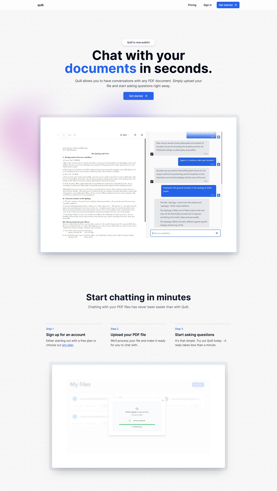
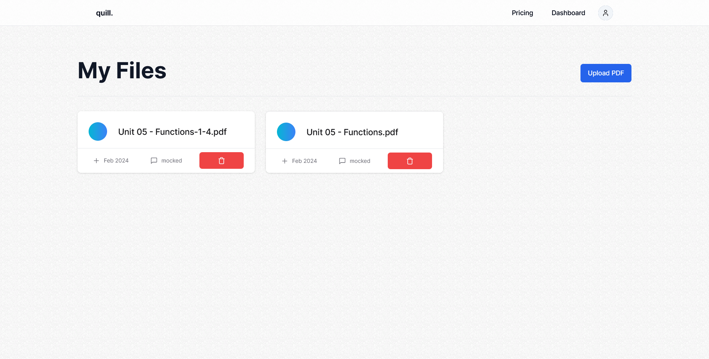
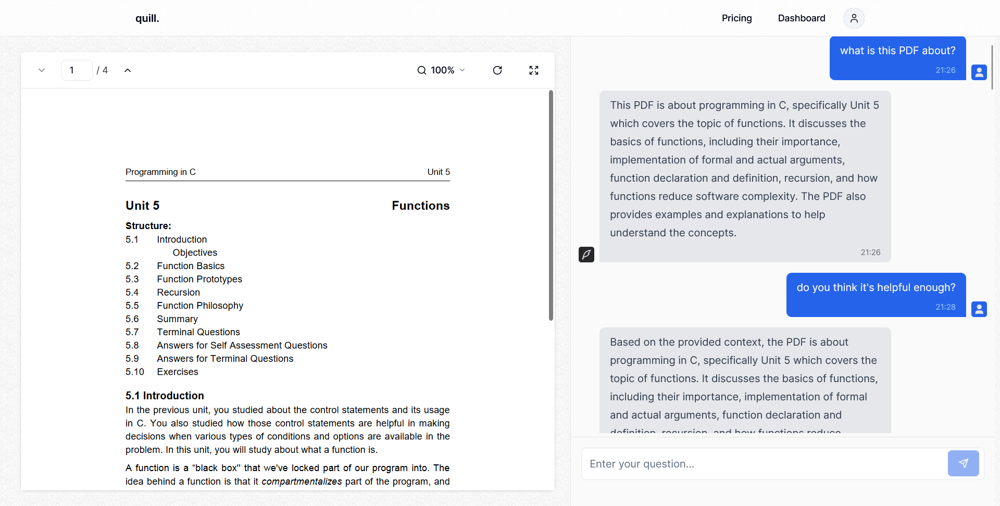

# Quill - Chat with PDF

This website let's you chat with your PDF. You can upload a PDF and start asking questions to the AI.

## Table of contents

- [Quill - Chat with PDF](#quill---chat-with-pdf)
  - [Table of contents](#table-of-contents)
  - [Overview](#overview)
    - [The challenge](#the-challenge)
    - [Screenshots](#screenshots)
    - [Links](#links)
  - [My process](#my-process)
    - [Built with](#built-with)
    - [Challenges I faced](#challenges-i-faced)
  - [Acknowledgements](#acknowledgements)
  - [Author](#author)
  - [Run Locally](#run-locally)

## Overview

### The challenge

Users should be able to:

- Upload a PDF to the website
- Ask questions about the PDF to AI
- Subscribe to Pro membership for larger PDF sizes

### Screenshots

Homepage

Desktop

PDF Chat Page


### Links

- Solution URL: [GitHub](https://github.com/ChaudharyPradip/quill)
- Live Site URL: [Quill - Chat with PDF](https://quill-chat-app.netlify.app/)

## My process

### Built with

- [Next.js](https://nextjs.org/) - The React framework for the web
- [OpenAI](https://openai.com/) - For responding to chat questions
- [Langchain](https://www.langchain.com/) - Used to create and retrieve vectors of PDF
- [Planetscale](https://planetscale.com/) - SQL Database over http
- [Drizzle ORM](https://orm.drizzle.team/) - ORM for interacting with database
- [Pinecon](https://www.pinecone.io/) - A vector database to store PDF vectors
- [Uploadthing](https://uploadthing.com/) - To store PDF files
- [Kinde Auth](https://kinde.com/) - A service for User Authentication
- [tRPC](https://trpc.io/) - A typesafe way to handle APIs
- [TanStack Query](https://tanstack.com/query/latest) - Used as wrapper around tRPC api calls and also for Infinite query and streaming responses to chat
- [React Hook Form](https://react-hook-form.com/) - For managing forms on website with a lot of functionalities like error handling
- [Zod](https://zod.dev/) - For type validations
- [Stripe](https://stripe.com) - For payment processing
- [React PDF](https://react-pdf.org/) - Used to load PDF on client side
- [Shadcn UI](https://ui.shadcn.com/) - UI framework for react
- [Tailwind](https://tailwindcss.com/) - CSS framework

### Challenges I faced

- The project was originally built using Prisma ORM and it was really hard and learning journey of moving to Drizzle ORM for database interactions\
- It was really challenging to make the stream responses to the chat working properly

## Acknowledgements

- [Chat GPT](https://chat.openai.com/) - My developer buddy who helped me brainstorm various approaches to tackle my issues and gave solutions. (Though it frustrates sometimes when it doesn't have answer and keeps on giving same invaluable output, it was a good help overall)

## Author

- Frontend Mentor - [@ChaudharyPradip](https://www.frontendmentor.io/profile/ChaudharyPradip)
- Twitter - [@thePradiptalks](https://www.twitter.com/thePradiptalks)

## Run Locally

Clone the project

```bash
  git clone https://github.com/ChaudharyPradip/quill
```

Go to the project directory

```bash
  cd quill
```

Install dependencies

```bash
  pnpm install
```

Copy env.example as .env and fill in the required Environment variables

```bash
  cp .env.example .env
```

Start the server

```bash
  pnpm run dev
```
